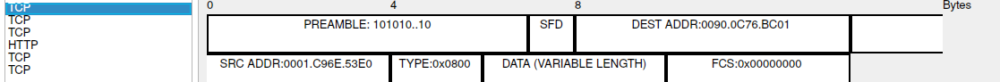
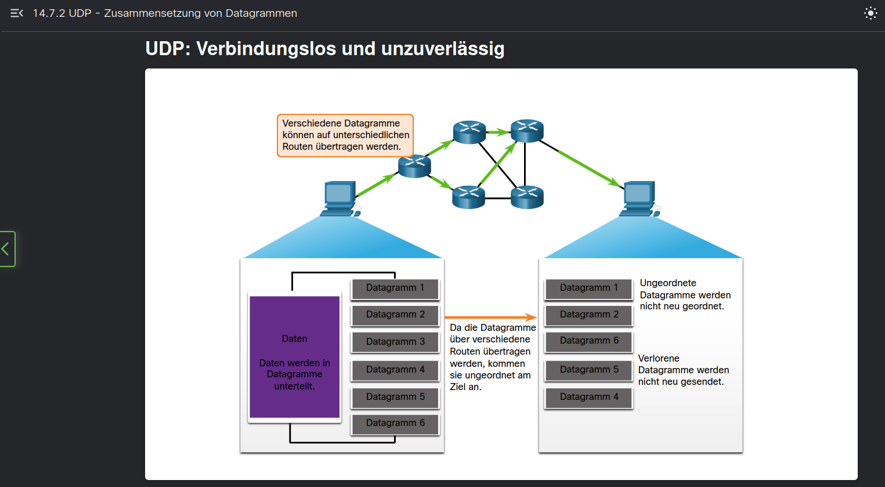

# Praktikum 4
a) Bauen Sie das Netzwerk gemäß der Netzwerkskizze auf. Verwenden Sie dazu Ihre
Dokumentation aus Praktikum 3.
- direkte Kopie aus Praktikum 3

b), c) und d)
- In Cisco Packet Tracer ist unmöglich eine XAMPP zu installieren, daher wurde ein Server aus End-Device platziert um das gleiche Verhalten des Servers zu simulieren.
- Der Server ist mit R1 angeschlossen und wie folgt eingestellt:
```yaml
IP Address: 192.168.1.10 
Subnet Mask: 255.255.255.0
Default Gateway: 192.168.1.1

Interface (R1): g0/0
```

Im Server wurde `HTTP`, `HTTPS` und `FTP` aktiviert, davon die Einstellung von FTP:
```yaml
Username: cisco
Password: cisco
Permissions: Read/Write
```

Die entsprechende static route werden in jedem Route eingestellt, damit die PC1/2/3 den Server erreichen kann.

d) Nennen Sie die Vor- und Nachteile von TCP und UDP. Wann sollte das jeweilige
Protokoll genutzt werden? Für welchen Anwendungsfall ist es geeignet?
- TCP
	- Vorteil: Versand der Datenpackete mit Bestätigung bzw. Verbindungsorientiert (3 way hand shake)
	- Nachteil: relative langsame im Vergleich zur UDP, höher Overhaed (länger Header)
	- Anwendungsfall: mit Anforderung der Zuverlässigkeit der Datentransport, z.B. E-Mail, FTP oder Datenbank
- UDP
	- Vorteil: schnell bei Datenaustausch, kein Handshake-Machenismus wie TCP damit Zeit gespart werden kann
	- Nachteil: keine zuverlässige Zustellungsbestätigung wie TCP, keine Flusskontrol
	- Anwendungsfall: Anforderung an shnelle Datentransport mit weniger Latzenz. Z.b. Netzspeiel CS, Telefonat oder Video-Streaming.

e) Welche Protokolle der Anwendungsschicht nutzen TCP beziehungsweise UDP?
Nennen Sie jeweils drei Beispiele inklusive der standardisierten Ports.
## TCP

| Anwendungsschicht-Protokoll      | Standard-Port    | Zweck                  |
| -------------------------------- | ---------------- | ---------------------- |
| **HTTP**                         | **80**           | Webzugriffe, Webseiten |
| **HTTPS**                        | **443**          | Verschlüsseltes Web    |
| **FTP** (File Transfer Protocol) | **21** (Control) | Dateiübertragung       |
| **SMTP**                         | **25**           | E-Mail Versand         |
| **IMAP**                         | **143**          | E-Mail Abruf           |
| **POP3**                         | **110**          | E-Mail Abruf           |

## UDP
| Anwendungsschicht-Protokoll | Standard-Port | Zweck                                        |
| --------------------------- | ------------- | -------------------------------------------- |
| **DNS** (Name Lookup)       | **53**        | Schnelle Namensauflösung                     |
| **DHCP**                    | **67/68**     | Zuweisung von IP-Adressen                    |
| **TFTP** (Trivial FTP)      | **69**        | Einfache Dateiübertragung (z. B. Bootloader) |
| **SNMP**                    | **161**       | Netzwerkmanagement                           |
| **NTP**                     | **123**       | Zeitsynchronisation                          |

f) Welche Informationen werden im „Window“-Feld des TCP-Headers gespeichert?
- "Window Size" gibt an, wie viele Bytes kann der Empfänger nach Bestätigung der Sqeunznummer noch aufnehmen darf.
- Eine Menachnismus für Flusskontroll, damit der Kanal nicht überlastet werden.

g) Erläutern Sie den Verbindungsauf- und abbau im TCP mit Hilfe eines Sniffer-Traces?
- um dies zu simulieren wird eine Sniffer-Trance zwischen PC1 und R1 aufgebaut
- Ein HTTP Anfrage wurde von PC1 abgerufen (durch web-browser mit `http://192.168.1.10`)
- Es wurde zuerst drei TCP Pakete aufgenommen:
	- Paket 1: Sequenznummer = 0, Flag ........10 (SYN: Synchronisation)
	- Paket 2: Sequenznummer = 0, Flag ....10001 (SYN + ACT)
	- Paket 2: Sequenznummer = 1, Flag ....10000 (ACT)
- Danach wird ein HTTP Packet versendet
  

i) wird im Labor ausgeführt

j) Wie stellt UDP sicher, dass die Daten in der richtigen Reihenfolge ankommen?
- Es ist nicht möglich die Daten in der richtige Reihenfolge anzukommen, da es keine entsprechende Mechanismus gibt. Siehe Bild in CCNA, 14.7.2
- 
