# Praktikum 5

## A1_Nameauflösung

c) Vergeben Sie in der Host-Datei von PC3 folgende Namen und berücksichtigen Sie sowohl IPv4 als auch IPv6-Adressen:
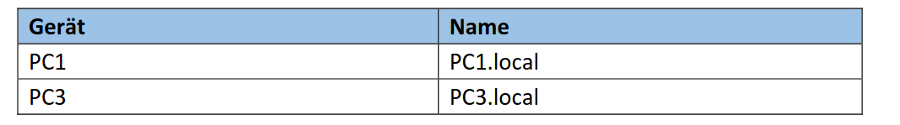

- Es kann sowohl per Hostdatei oder DNS-Server die Hostname aufgelöst werden. In CISCO-Paket tracer ist die Bearbeitung der Hostdatei nicht möglich, deshalb wird hier die Nameauflösung per eine extra hinzufügende DNS-Server realisiert werden. Der Bearbeitungsprozess der Hostdatei wird Ende der Aufgabestellung dargestellt.
- 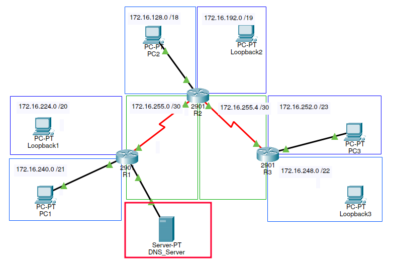

- Einstellung des DNS-Server:
```yaml
IP Address: 172.16.100.10
Subnet Mask: 255.255.0.0
Default Gateway: 172.16.100.1

Interface (R1): g0/1
```

- Einstellung der interface `.in R1`:
```yaml
Ip Adress: 172.16.100.1
```

- Zusätzlich muss die aufzulösende Hostname in DNS-Server eingestellt, schließlich muss der DNS-Server initialisiert werden.
- 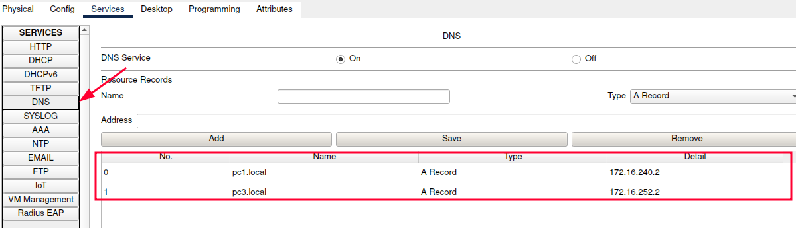

- Bei Pingen per Nameauflösung, muss in PC1 und PC3 der DNS-Server manuell auf den extra Server eingestellt werden:
- 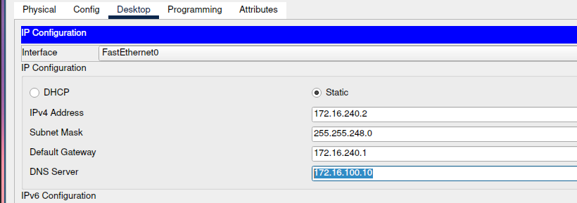

- Dann in PC1 die PC3 per `Ping PC3.local` pingen:
- 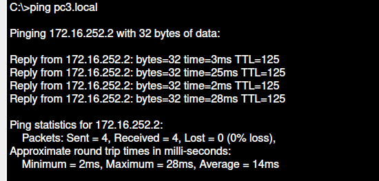

### Bearbeitungsprozess der Hostdatei in PC im Labor
`C:\Windows\System32\drivers\etc\hosts`

**- IP-Adresse selbst anzupassen:**
```yaml
# IPv4
192.168.1.10   PC1.local
192.168.1.30   PC3.local

# IPv6
2001:db8:1::10 PC1.local
2001:db8:1::30 PC3.local

```

d) Versuchen Sie über die eingetragenen Namen am PC3 die Computer mit einem Ping zu erreichen. Erstellen Sie davon einen Sniffer-Trace und erläutern Sie diesen
- im Labor machen

e)Konfigurieren Sie den PC1 als DNS-Server und testen Sie Ihren Aufbau. Erfolgt eine Namensauflösung? Zeigen Sie diese anhand eines Sniffer-Trace
- Im Labor durchzuführen
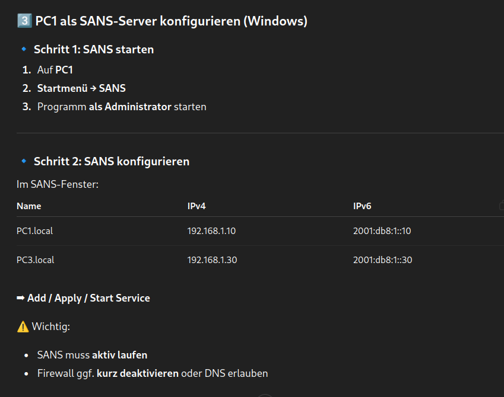
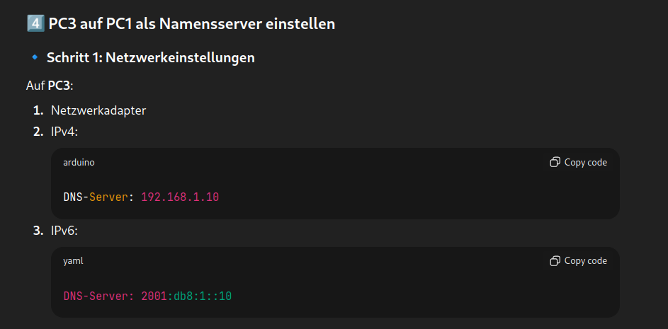


g) Wie wird mit DNS ein Name aufgelöst? Nennen Sie die notwendigen einzelnen Schritte anhand eines Beispiels.

Ein Client (PC3) möchte den Namen **`PC1.local`** auflösen, um PC1 zu erreichen.

## Schritt-für-Schritt-Ablauf der DNS-Namensauflösung

### **1️⃣ Anwendung fordert Namensauflösung an**

Der Benutzer gibt ein:
```text
ping PC1.local
```

Das Betriebssystem erkennt:
➡ Der Name **PC1.local** muss in eine IP-Adresse aufgelöst werden.

---

### **2️⃣ Lokale Prüfung (Cach.osts-Datei)**

Der Client prüft zuerst:

* DNS-Cache
* Hosts-Datei

➡ **Kein Eintrag gefunden** → DNS wird befragt.

---

### **3️⃣ DNS-Anfrage an den konfigurierten DNS-Server**

Der Client sendet eine **DNS Query** an seinen DNS-Server (z. B. PC1):

* Typ **A** (IPv4)
* Typ **AAAA** (IPv6)

Beispiel:

```
Query: PC1.local → A, AAAA
```

---

### **4️⃣ DNS-Server verarbeitet die Anfrage**

Der DNS-Server:

* durchsucht seine Zone (`local`)
* findet den Eintrag für `PC1.local`

Beispiel:

```
PC1.local → 192.168.1.10
PC1.local → 2001:db8:1::10
```

---

### **5️⃣ DNS-Antwort an den Client**

Der DNS-Server sendet eine **DNS Response** zurück:

* IPv4-Adresse (A-Record)
* IPv6-Adresse (AAAA-Record)

---

### **6️⃣ Client speichert Ergebnis im DNS-Cache**

Der Client speichert die erhaltene Adresse:

* für spätere Anfragen
* für die Dauer der TTL (Time To Live)

---

### **7️⃣ Anwendung nutzt die IP-Adresse**

Jetzt kennt der Client die IP-Adresse und startet die eigentliche Kommunikation:

* ICMP Echo Request (Ping)
* TC.DP (z. B. HTTP, SSH)

➡ **Namensauflösung ist abgeschlossen**

---

## Darstellung als Kurzablauf (sehr prüfungsgeeignet)

```
Ping PC1.local
↓
Cach.osts prüfen
↓
DNS Query an DNS-Server
↓
DNS-Server sucht Eintrag
↓
DNS Response mit IP
↓
IP wird genutzt (z. B. ICMP)
```

---

## Wichtige Zusatzpunkte (Bonu.ündliche Prüfung)

* DNS arbeitet standardmäßig über **UDP Port 53**
* Bei großen Antworten oder Fehlern → **TCP 53**
* IPv6 fragt zuerst oft **AAAA**, dann **A**
* DNS erfolgt **immer vor** der eigentlichen Datenübertragung
blaufdarstellung**
* oder die **Wireshark-Zuordnung der Schritte**

## A2 Automatische Adresszuweisung im IPv4
a) Konfigurieren Sie den Router R1 als DHCP-Server für alle Netzwerke mit Computern.
 - Legen Sie einen DHCP-Pool für jedes Netzwerk an.
 - Achten Sie darauf, dass die ersten zehn IP-Adressen nicht verwendet werden

R1 als DHCP-Server, R2 und R3 müssen auch als DHCP-Relay funktionieren.

In R1:
```yaml
R1(config)# service dhcp
R1(config)# ip dhcp excluded-address 172.16.240.1 172.16.240.10 \\ für PC1
R1(config)# ip dhcp excluded-address 172.16.128.1 172.16.128.10 \\ für PC2
R1(config)# ip dhcp excluded-address 172.16.252.1 172.16.252.10 \\ für PC3


R1(config)# ip dhcp pool PC1_NET
R1(dhcp-config)# network 172.16.240.0 255.255.248.0
R1(dhcp-config)# default-router 172.16.240.1
R1(dhcp-config)# exit

R1(config)# ip dhcp pool PC2_NET
R1(dhcp-config)# network 172.16.128.0 255.255.192.0
R1(dhcp-config)# default-router 172.16.128.1
R1(dhcp-config)# exit

R1(config)# ip dhcp pool PC3_NET
R1(dhcp-config)# network 172.16.252.0 255.255.254.0
R1(dhcp-config)# default-router 172.16.252.1
R1(dhcp-config)# exit
```

Auf R2:
```yaml
R2(config)# interface GigabitEthernet0/0
R2(config-if)# ip helper-address 172.16.240.1
R2(config-if)# exit
```

Auf R3:
```yaml
R3(config)# interface GigabitEthernet0/0
R3(config-if)# ip helper-address 172.16.240.1
R3(config-if)# exit
```

Um Ergebnis zu prüfen, in R1:
```
show ip dhcp binding
show ip dhcp pool
```

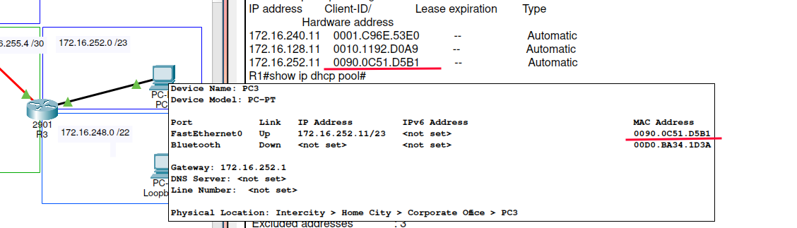

b) Erläutern Sie den Vergabeprozess von IP-Adressen mittels DHCP mit Hilfe eines Sniffer-Traces. Welche Netzwerke werden nun aktiv vom DHCP-Server verwaltet?
Siehe CCNA: 7.1.3
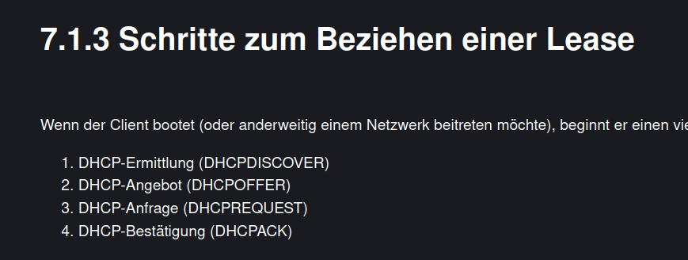

c) Konfigurieren Sie R2 und R3 so, dass DHCP-Anfragen an den zuständigen DHCP-Server weitergeleitet werden. Erläutern Sie etwaige Anpassungen der DHCP-Pakete.
DHCP-Relay Einstellung, siehe a)

d) Lassen Sie sich auf R1 die vergebenen IP-Adressen anzeigen

```
show ip dhcp binding
```
Ip address siehe a)


## A3 Automatische Adresszuweisung im IPv6
a) Wie werden im IPv6-Adressen mittels Stateless Address Autoconfiguration (SLAAC) verteilt? Zeichnen Sie den Vergabeprozess mittels Sniffer-Trace auf und erläutern Sie diesen?
- CCNA, 8.2
```
PC einschalten
↓
LLA automatisch generiert
↓
Router Solicitation (ICMPv6 Type 133)
↓
Router Advertisement (ICMPv6 Type 134)
↓
PC erstellt IPv6-Adresse (Präfix + Interface-ID)
↓
Duplicate Address Detection (ICMPv6 .)
↓
Adresse aktiv → Kommunikation möglich
```

b) Wie werden doppelte IPv6 Adressen bei SLAAC verhindert?
- Duplicate Address Detection (DAD). siehe CCNA 8.2.6

c) Welche zwei Betriebsmodi kann ein DHCPv6-Server haben? Erläutern Sie die Gemeinsamkeiten und Unterschiede?
- CCNA 8.3, sonst ist das Bild von 8.1.3 sehr ersichtlich
  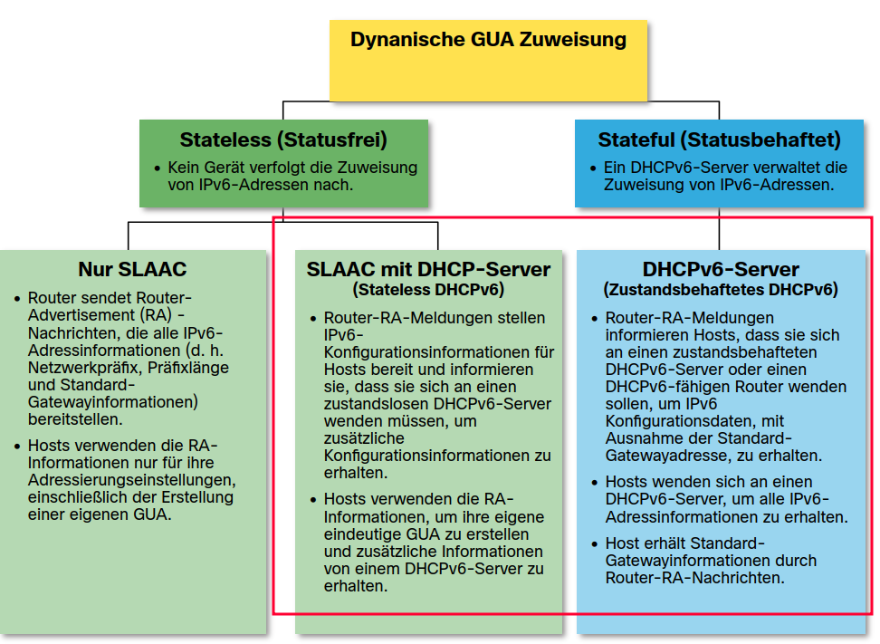

| Merkmal                 | Stateless DHCPv6 | Stateful DHCPv6   |
| ----------------------- | ---------------- | ----------------- |
| Vergibt IPv6-Adresse    | ❌ Nein           | ✅ Ja              |
| Nutzt SLAAC             | ✅ Ja             | ❌ Nein            |
| Server speichert Leases | ❌ Nein           | ✅ Ja              |
| RA-Flag                 | O-Flag = 1       | M-Flag = 1        |
| Vergleich zu IPv4       | Ergänzend        | Ähnlich zu DHCPv4 |

d) Wie wird einem Client der DHCPv6 Server und dessen Betriebsmodus bekannt
gegeben?
- Ein IPv6-Client erfährt die Existenz und den Betriebsmodus eines DHCPv6-Servers über Router Advertisements (RA), genauer über die M- und O-Flags. Siehe CCNA 8.3.2 und 8.3.4

| M-Flag | O-Flag | Betriebsmodus    | Verhalten des Clients       |
| ------ | ------ | ---------------- | --------------------------- |
| 0      | 0      | Nur SLAAC        | Keine DHCPv6-Nutzung        |
| 0      | 1      | Stateless DHCPv6 | SLAAC + DHCPv6 für Optionen |
| 1      | 0      | Stateful DHCPv6  | DHCPv6 vergibt Adresse      |
| 1      | 1      | (selten)         | DHCPv6 für alles            |

e) Konfigurieren Sie den DHCPv6 Server auf dem Router R3 für das dortige Netzwerk mit Computer.

f) Ordnen Sie den DHCPv6 Pool der notwendigen Schnittstelle zu und Konfigurieren Sie das Interface so, dass Clients über den DHCPv6-Server Adressen erhalten

h) Lassen Sie sich die vergebenen IPv6-Adressen am Router R3 anzeigen.
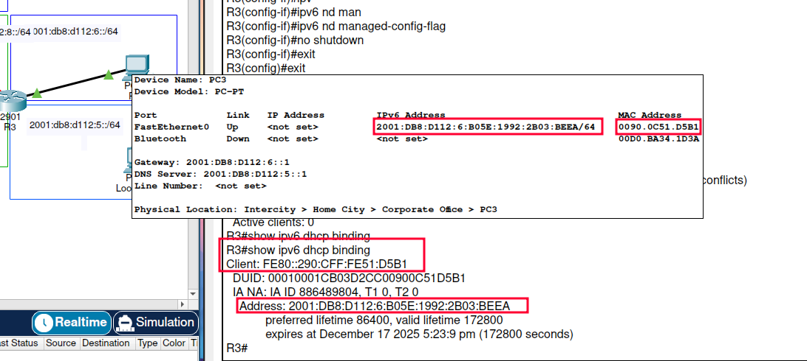
